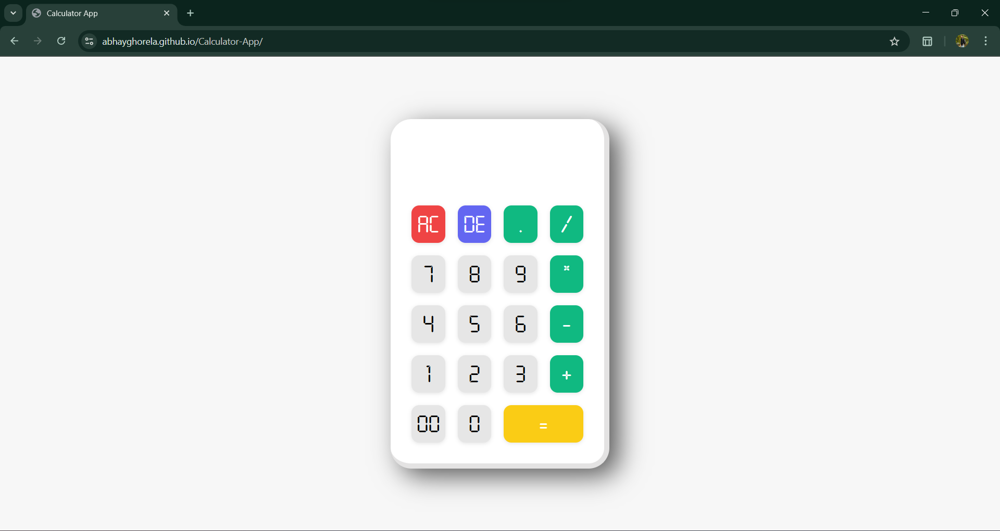

# ⚡ 3D Calculator Web App

A stylish, lightweight, and functional **calculator app** built using **HTML**, **SCSS**, and **JavaScript** — designed with a smooth 3D soft UI for a modern user experience.

---

## 🎯 What Makes It Cool?

✅ Beautiful 3D Neumorphic Design  
✅ Fully Functional Calculator Logic  
✅ Smooth Button Press Animations  
✅ Clean Code Structure with SCSS  
✅ Operator Validation Logic
✅ Fully Responsive & Easy to Customize

---

## 🧱 Built With

- **HTML** – semantic structure  
- **SCSS** – reusable, clean, and customizable styles  
- **Vanilla JavaScript** – handles calculation, input logic & interaction

---

## 🔍 Preview

> 👇 Looks something like this!



---

## 🚀 How to Use

1. **Clone the repo**:
```bash
git clone https://github.com/AbhayGhorela/3d-calculator.git
cd 3d-calculator
````

2. **Open the app**:
   Just open `index.html` in your browser!

---

## 🧠 Core Logic

* Prevents multiple operators in a row
* Buttons scale slightly on press for tactile feedback
* Input/output shown dynamically on the display

---

## 💡 Folder Structure

```
📦 3d-calculator/
├── index.html      # App layout
├── style.scss      # SCSS styles
├── style.css       # Compiled CSS
├── script.js       # JavaScript logic
└── README.md
```

---

## 🙋‍♂️ About Me

Built with ❤️ by Abhay Kumar Ghorela
If you like this project, give it a ⭐ on GitHub!

---

